```python
import glob  # for creating a list of files
from scintools.dynspec import Dynspec  # The dynamic spectrum class

data_dir = "./J0437-4715"
dyn_files = sorted(glob.glob(data_dir + '/*.dynspec'))
```


```python
dyn = Dynspec(filename=data_dir+'/full.ar2.ds', process=False)  # loads the first dynamic spectrum, without processing
dyn.plot_dyn()  # plot the dynamic spectrum
```

    LOADING ./J0437-4715/full.ar2.ds...
    ...LOADED in 3.23 seconds
    
    	 OBSERVATION PROPERTIES
    
    filename:			full.ar2.ds
    MJD:				57718.6736804292
    Centre frequency (MHz):		184.96
    Bandwidth (MHz):		30.72
    Channel bandwidth (MHz):	0.01
    Integration time (s):		1890
    Subintegration time (s):	10


    
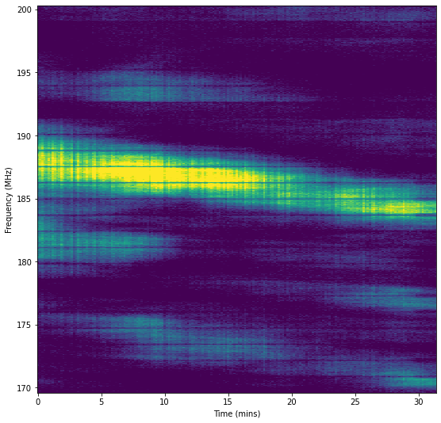
    


```python
dyn.trim_edges()
dyn.refill()
dyn.plot_dyn()
```


    

    


```python
dyn.plot_acf()
dyn.plot_sspec()
```

    /usr/local/lib/python3.9/site-packages/scintools-0.2-py3.9.egg/scintools/dynspec.py:338: MatplotlibDeprecationWarning: shading='flat' when X and Y have the same dimensions as C is deprecated since 3.3.  Either specify the corners of the quadrilaterals with X and Y, or pass shading='auto', 'nearest' or 'gouraud', or set rcParams['pcolor.shading'].  This will become an error two minor releases later.
      ax1.pcolormesh(t_delays, f_shifts, arr[:, 1:], linewidth=0,


    
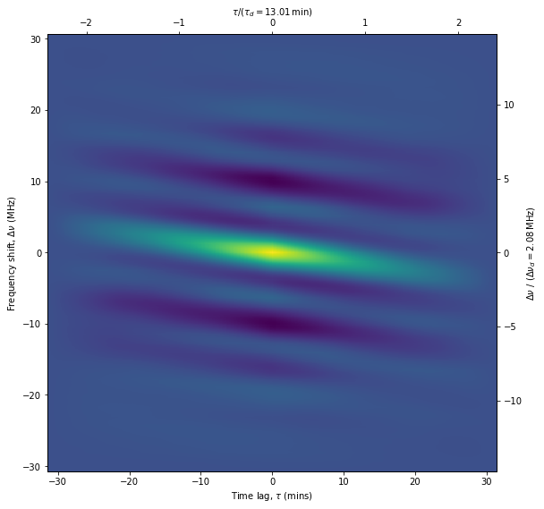
    


    
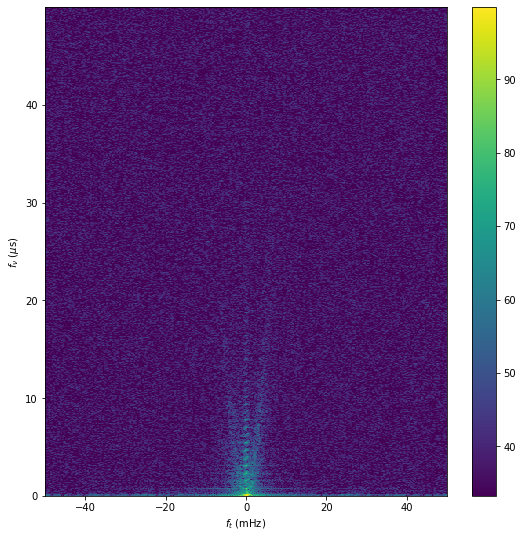
    


```python
import glob  # for creating a list of files
from scintools.dynspec import Dynspec  # The dynamic spectrum class

data_dir = "./J0437-4715"
dyn_files = sorted(glob.glob(data_dir + '/*.dynspec'))

dyn = Dynspec(filename=data_dir+'/J0036-1033_20211030.pazi.ds', process=False)  # loads the first dynamic spectrum, without processing
dyn.plot_dyn()  # plot the dynamic spectrum
```

    LOADING ./J0437-4715/J0036-1033_20211030.pazi.ds...
    ...LOADED in 0.11 seconds
    
    	 OBSERVATION PROPERTIES
    
    filename:			J0036-1033_20211030.pazi.ds
    MJD:				59517.5846653745
    Centre frequency (MHz):		1250.0
    Bandwidth (MHz):		500.0
    Channel bandwidth (MHz):	3.90624
    Integration time (s):		2960
    Subintegration time (s):	20


    
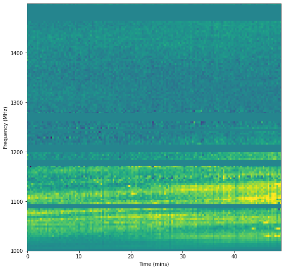
    


```python
dyn.trim_edges()
dyn.refill()
dyn.plot_dyn()
```


    
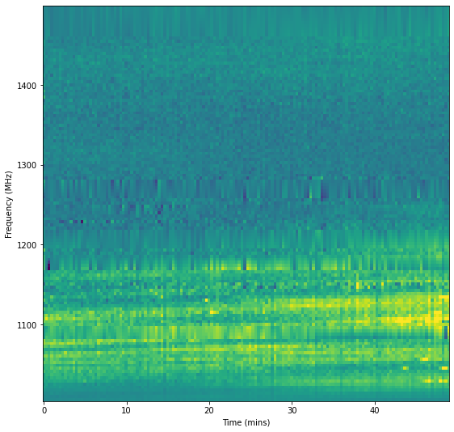
    


```python
dyn.plot_acf()
dyn.plot_sspec()
```


    
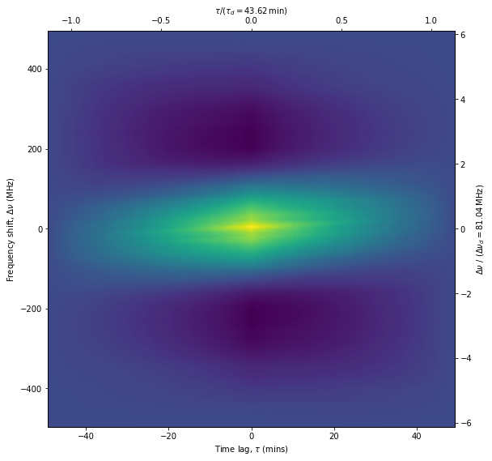
    


    
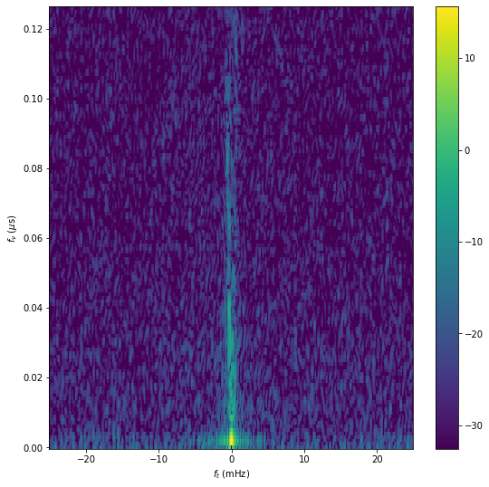
    


```python
import glob  # for creating a list of files
from scintools.dynspec import Dynspec  # The dynamic spectrum class

data_dir = "./J0437-4715"
dyn_files = sorted(glob.glob(data_dir + '/*.dynspec'))

dyn = Dynspec(filename=data_dir+'/J0036-1033_20220626.pazi2.ds', process=False)  # loads the first dynamic spectrum, without processing
dyn.plot_dyn()  # plot the dynamic spectrum
```

    LOADING ./J0437-4715/J0036-1033_20220626.pazi2.ds...
    ...LOADED in 0.13 seconds
    
    	 OBSERVATION PROPERTIES
    
    filename:			J0036-1033_20220626.pazi2.ds
    MJD:				59755.9472660536
    Centre frequency (MHz):		1250.0
    Bandwidth (MHz):		500.0
    Channel bandwidth (MHz):	3.90624
    Integration time (s):		3540
    Subintegration time (s):	20


    
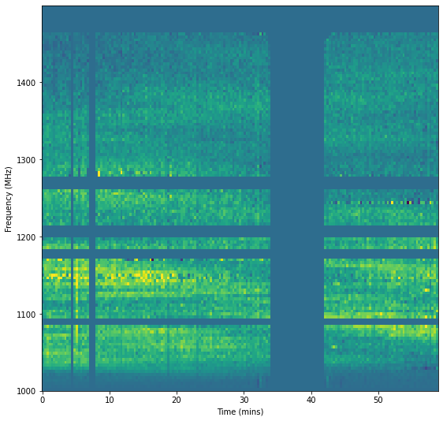
    


```python
dyn.trim_edges()
dyn.refill()
dyn.plot_dyn()
```


    
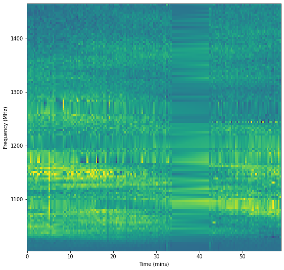
    


```python
dyn.plot_acf()
dyn.plot_sspec()
```


    
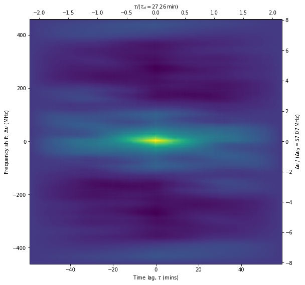
    


    
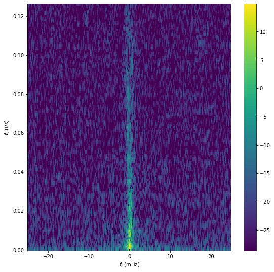
    


```python

```
